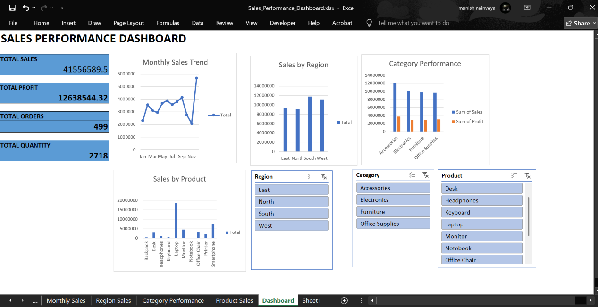

# 📊 Sales Performance Dashboard — Microsoft Excel

An interactive **Sales Performance Dashboard** developed in Microsoft Excel to analyze sales, profit, orders, quantity, monthly trends, regional performance, category performance, and product-wise sales.

The dashboard uses **PivotTables, PivotCharts, KPI Cards, and Interactive Slicers** to provide dynamic business insights.

---

## 🎯 Project Overview

This project was created to demonstrate practical skills in **Excel data analysis, dashboard development, data visualization, and business reporting**.

The dashboard helps users quickly understand overall sales performance and explore the data using interactive filters.

---

## 📌 Key Performance Indicators

- 💰 **Total Sales:** 41,556,589.50
- 📈 **Total Profit:** 12,638,544.32
- 🧾 **Total Orders:** 499
- 📦 **Total Quantity:** 2,718

---

## 📊 Dashboard Features

### KPI Analysis
- Total Sales
- Total Profit
- Total Orders
- Total Quantity

### Sales Analysis
- Monthly Sales Trend
- Sales by Region
- Category Performance
- Sales by Product

### Interactive Filters
- Region Slicer
- Category Slicer
- Product Slicer

All slicers are connected to the dashboard PivotTables and charts for dynamic analysis.

---

## 🛠️ Tools & Skills

- Microsoft Excel
- PivotTables
- PivotCharts
- Slicers
- Data Analysis
- Data Visualization
- Dashboard Design
- Business Reporting
## 📥 Project File

[Download Sales Performance Dashboard](Sales_Performance_Dashboard.xlsx)
---

## 📂 Dataset

The dataset contains sales transaction records with fields including:

- Order ID
- Order Date
- Customer
- Region
- Category
- Product
- Quantity
- Unit Price
- Discount
- Sales
- Cost
- Profit

---

## 📈 Dashboard Insights

The dashboard can be used to identify:

- Overall sales and profitability
- Monthly sales trends
- Best-performing regions
- Category-wise performance
- Product-wise sales performance
- Impact of interactive filters on business metrics

---

## 📁 Project Files

| File | Description |
|---|---|
| `Sales_Performance_Dashboard.xlsx.xlsx` | Complete Excel Sales Performance Dashboard |

---

## 🚀 How to Use

1. Download the Excel dashboard file.
2. Open it using Microsoft Excel.
3. Go to the **Dashboard** sheet.
4. Use the **Region, Category, and Product slicers** to interact with the dashboard.
5. Explore the charts and KPI cards for business insights.

---

## 👨‍💻 Skills Demonstrated

This project demonstrates practical experience in:

**Excel Data Analysis • Dashboard Development • Data Visualization • PivotTables • PivotCharts • Interactive Reporting**

---

## ⭐ Project Purpose

This project is part of my **Data Analytics Portfolio** and demonstrates my ability to transform raw sales data into an interactive and visually meaningful business dashboard.

## 📊 Dashboard Preview

